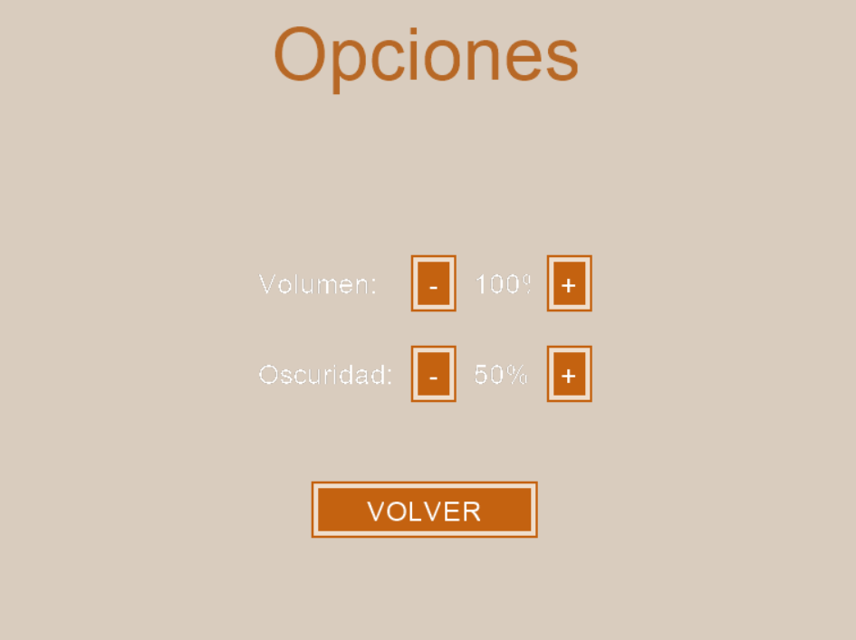
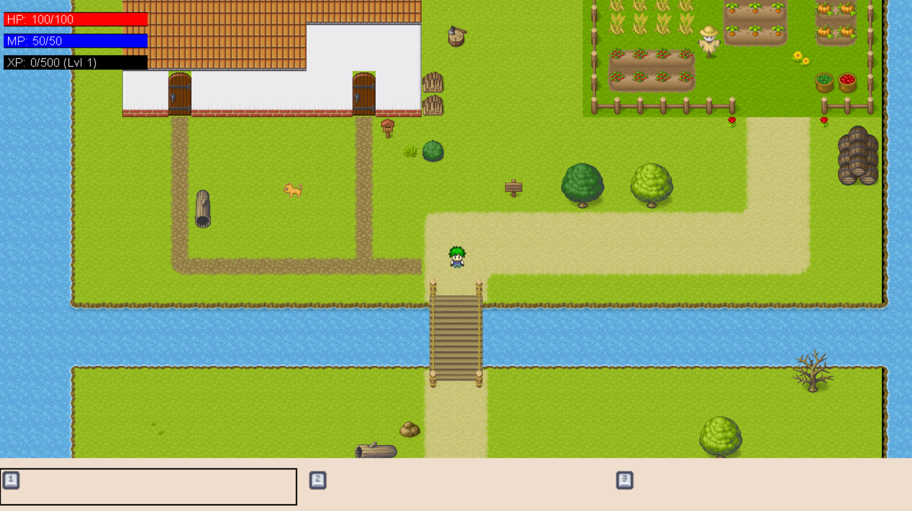
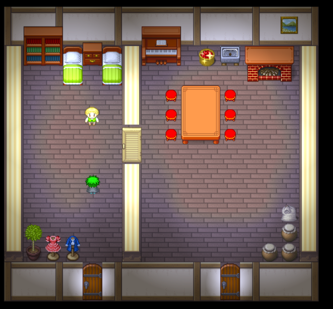
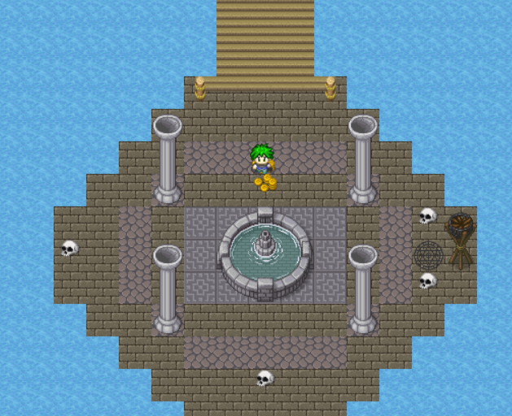
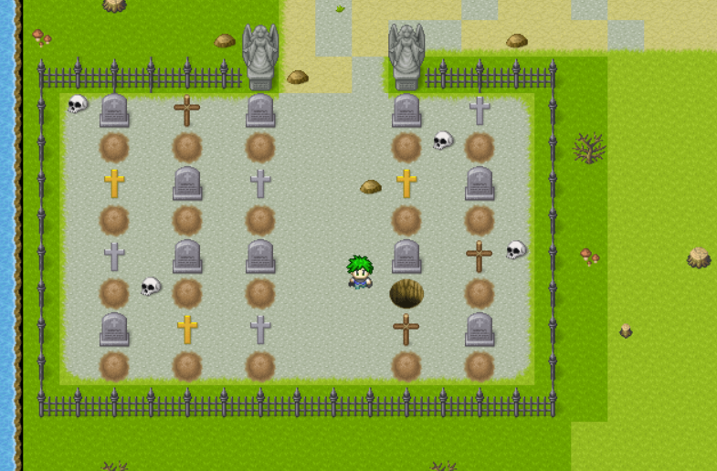
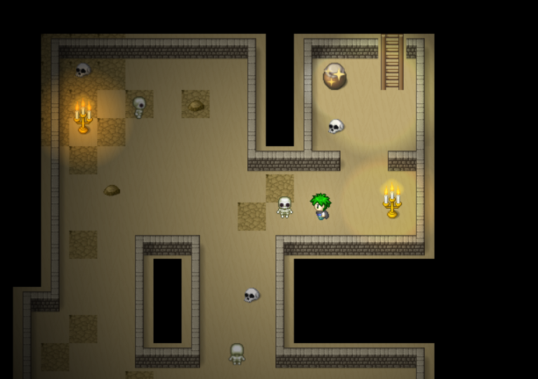
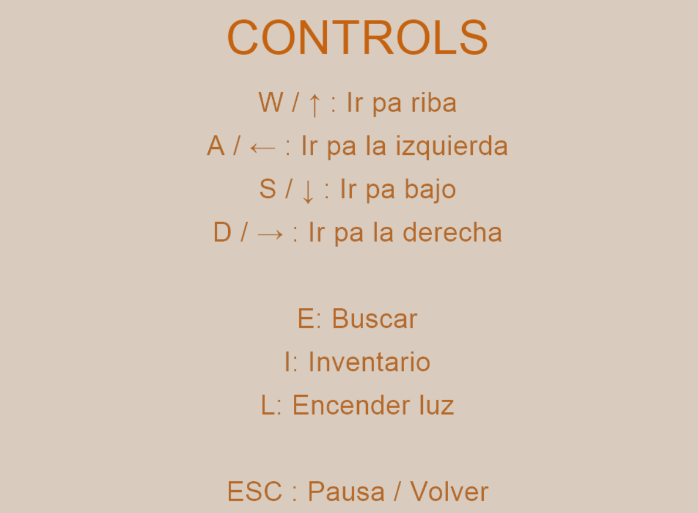
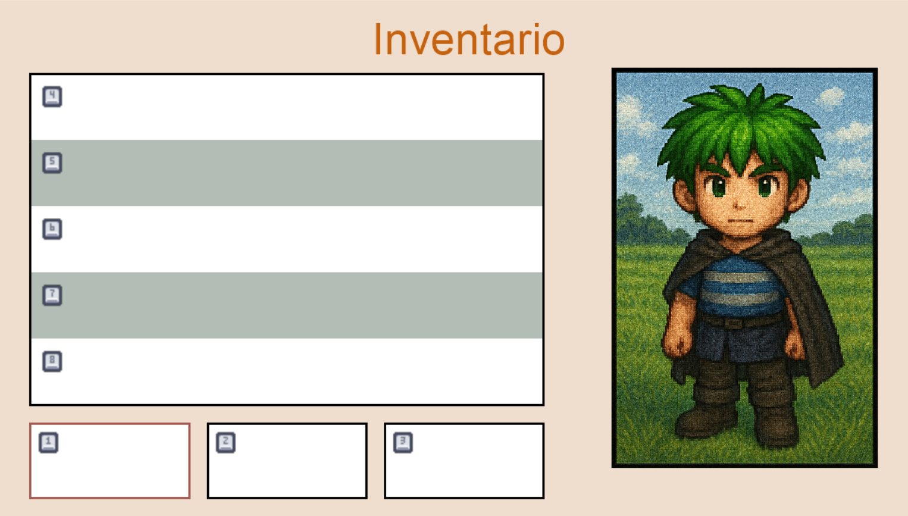
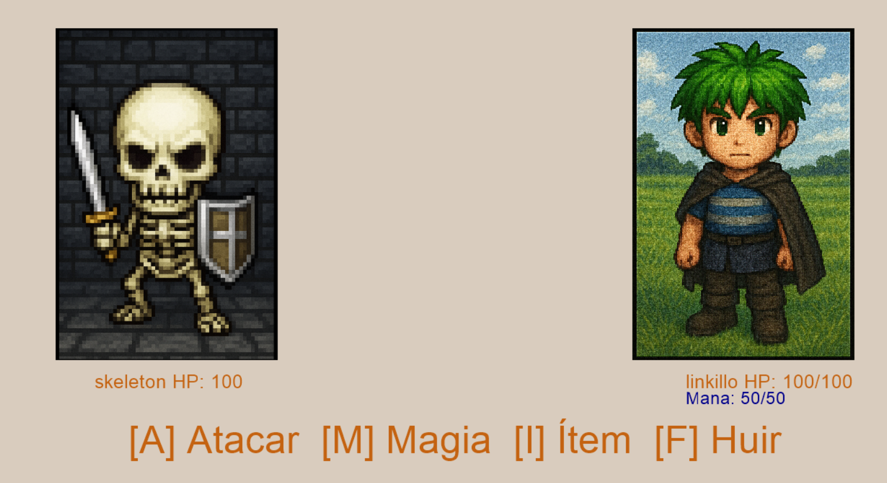

## Nombre del videojuego: La Maldición del Peluche Infernal

## Memoria
El primer paso del grupo en el progreso del videojuego se presenta con la etapa de diseño y lluvia de ideas sobre el videojuego que queriamos lograr, para ello exploramos la plantilla entregada por el profesor e investigamos las herramientas de Tiled empezamos a hacer pruebas modificando el main map.

Para poder seguir el progreso del juego realizamos una lista de objetivos/tareas en forma de Issues de gitHub. Desde un principio tuvimos claro que el juego iba a ser un estilo Zelda con toques de humor y batalla por turnos.

Al tener todos tareas asignadas el resto del tiempo se baso en la resolucion de dichas tareas, cada uno por su cuenta y con la ayuda de todos si surgia alguna duda.
///////////////////////////////////////////////////////////////////////////////////////
El primer día, se nos presentó el proyecto y descargamos el repositorio de la plantilla
para probarla y ver donde se ubicaban las cosas dentro de este proyecto. Ese día nos
centramos en conocer al grupo y destacar que cosas eran necesarias de arreglar de la 
plantilla. 

El segundo día nos reunimos en el laboratorio y hicimos una lluvia de ideas de como iba
a ser el juego, entre todos decidimos que este juego sería un juego basado en el humor
con un estilo similar a "the legend of zelda" pero con las mecánicas de combate por turnos.

Con el diseño ya en mente el jefe de proyecto distribuiría las tareas a realizar via 
GitHub, de forma que la siguiente vez que nos reunimos en el laboratorio fuimos con las 
ideas claras y trabajamos cada uno en su lista de tareas, ese mismo día después de la 
clase de teoría la mayoría del grupo termino o dejo casi terminadas sus tareas.

La semana previa al examen para centrarnos en estudiar acordamos que puliríamos lo que ya
teníamos para no sobrecargarnos de trabajo, una vez que el examen se realizó el jefe de
proyecto envió nuevas tareas esta vez por medio de WhatsApp, al ser más complejas llevaron
más tiempo y problemas (como la interacción del jugador con los npcs), pero fueron acabadas 
para la fecha de entrega.

## Manual de usuario
Inicia la aventura La Maldición del Peluche Infernal, este es el punto de no retorno en el que decidiras si vives la emocionante aventura de nuestro protagonista Linkillo o seguiras con tu triste y monotona vida de jugador.

Si te decides por el camino de la libertad y la emocion, apareceras en este alegre y colorido campo junto a tu casa, en la que convives con tu querido hermano.

Todo parece un sueño inimaginable y parece imposible que algo malo suceda... 
Eso pensabas hasta que hablaste con tu hermano en la casa...

En tu camino a la peligrosa y "supermegaimportante" mision que te ha sido encomendada encontraras diferentes estructuras y monumentos, algunos mas vivos que otros.
Esta es ***_¡LA FUENTE INÚTIL DE LOS DESEOS!_***, el nombre lo dice todo..

Un paso adelante en tu aventura te encontraras con la ***Herreria Abandonada***, dejemoslo ahi..

Finalmente llegas a las oficinas de Nokia, ah no solo es un triste cementerio..

Pero **¡OJO!** algo maligno se esconde en su interior.. Te acercas y **¡ZASCA!** esta oscuro y no ves, procedes a encender una luz

En su interior te topas con innumerables Venezolanos en plenas elecciones

Mas alla de la mazmorra de la primera cueva la oscuridad asusta tanto como quedarte a 1HP en una boss fight, pero oye quien sabe igual incluso encuentras el amor..

## Tareas completadas
 ### Diseño
 - Crear historia general y narrativa del juego.

 - Diseñar al protagonista: Linkillo.

 - Diseñar al antagonista: Rey Demonio Patatón.

 - Diseñar a los 3 minibosses con caracteristicas y comportamientos diferentes.

 - Diseñar al NPC Don Yunque. (Si está hecho, pero no está implementado)

 - Diseñar al NPC Mochito.

 - Diseñar los objeto interactuables del mapa.

 - Implementar y ampliar las mecánicas del juego (combate, inventario, diálogo, objetos).

 - Definir las físicas (colisiones, desbloqueo de puertas, etc.).

 - Definir la secuencia de niveles (del nivel 1 al 7).

### Lógica del juego
 - Implementar la mecánica de combate.

 - Implementar la mecánica de inventario.

 - Implementar la mecánica de diálogo.

 - Implementar la progresión por niveles.

 - Implementar el sistema de objetos y mejora de estadísticas.

 - Implementar efectos de sonido al recoger objetos.

 - Implementar sistema de desbloqueo de puertas.

### Arte y Sonido

 - Localizar o crear hojas de sprites (personajes, enemigos, objetos).

 - Crear arte del menú de inicio.

 - Crear arte para cada vista del juego (batalla, inventario, ayuda, etc.).

 - Localizar o crear efectos de sonido.

 - Localizar o crear música ambiental.

 - Diseñar estética general estilo "medieval Zelda cómico".

### Control de calidad
 - Definir plan de pruebas (por niveles, mecánicas, estabilidad).

 - Ejecutar pruebas funcionales y de jugabilidad.

 - Comprobar el repositorio antes de entrega (nombres, estructura, coherencia).

### Documentación
 - Redactar documento de diseño (este mismo documento).

 - Redactar memoria del proyecto (estructura técnica + desarrollo).

 - Redactar instrucciones de uso del juego para el usuario final.

### Interfaz de usuario
 - Implementar menú de inicio.

 - Implementar vista de arranque.

 - Implementar vista de batalla.

 - Implementar vista de inventario.

 - Implementar vista de configuración.

 - Implementar vista de diálogo/NPCs.

 - Implementar transiciones entre niveles.
 - 
### Integración de niveles

 - Crear nivel 1 (casa pacífica).

 - Crear nivel 2 (jardín exterior).

 - Crear nivel 3 (herrería).

 - Crear nivel 4 y 5 (cementerio).

 - Crear niveles 6-7 (laberinto y sala del boss final).

 - Integrar todos los niveles en la lógica del juego.

### Audio y ambientación
 - Agregar música ambiental.

### Mecánicas
 - Pantalla inicial que ofrece a los jugadores un sitio para ver los controles
   Ajustar el volumen y brillo, salir del juego y obviamente iniciar aventura,
   a la cual se puede acceder en medio de la partida al apretar la tecla ESC.
   
   

 - Inventario donde el jugador puede almacenar los diferentes objetos que obtiene a lo largo de su aventura.
   Si alguno de dichos objetos tiene la capacidad de curar se puede interactuar con el objeto para realizar dicha opcion.

   

 - Hay una mecánica de combate en la que puedes luchar contra diferentes enemigos, en la 
   pantalla de batalla puedes seleccionar la opción de utilizar magia, atacar, usar objetos
   y huir. Ten cuidado existe la posibilidad de fallar al intentar escapar.

   

 - El jugador posee tres barras con las estadísticas de vida, mana y experiencia.

 - El jugador puede utilizar mana para hacer magia y hacer más daño a la hora de atacar, dicho mana se
   restaurará con el tiempo mientras no estes en combate.

 - Al terminar el combate el jugador recibirá experiencia con la que podrá subir de nivel
   y aumentar sus estadísticas.

 - El jugador puede interactuar con personajes, objetos y enemigos a través de cuadros de 
   diálogo.

### Tareas no completadas
 - No se ha podido implementar colisiones ni movimiento en los enemigos

 - La música da errores por el tamaño de la canción 

 - No hemos conseguido implementar al herrero que funcionaría como un nivel de tutorial

 - No hemos logrado el bloqueo de puertas 

### Dificultades
 - Con diferencia lo que más nos ha costado han sido las interacciones con los objetos y
   los enemigos, con estos últimos pensábamos que los habíamos logrado poner a la primera con 
   una ruta de movimiento y que funcionarían según lo esperado, pero al ser polígonos no 
   interactuaban según lo esperado, eso nos ha frenado mucho al no poder interactuar con los
   enemigos para poder seguir con la mecánica y seguir con el resto de cosas.

 - La battle view nos ha costado más de lo esperado el pasarle los datos de los jugadores y
   los enemigos y que al acabar la batalla modifique las barras de vida, mana, y experiencia
   del jugador.

